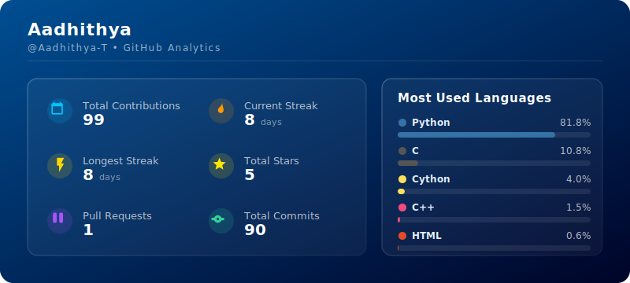

# Hi there, I'm Aadhithya 👋

Welcome to my GitHub profile! Here is a live breakdown of my contributions, streaks, and top technologies.

## 📊 Live GitHub Stats



---

## 🛠️ How to Setup on Your Profile

Follow these steps to wire this stats card into your GitHub profile repository (`Aadhithya-T/Aadhithya-T`):

1. **Create/Use Profile Repository**:
   Ensure you have a repository named `Aadhithya-T/Aadhithya-T` (matching your exact GitHub username).

2. **Add Files**:
   Place `generate_card.py` at the root of your repo, and `.github/workflows/update-card.yml` inside `.github/workflows/`.

3. **Generate & Save PAT Token**:
   - Go to GitHub **Settings** → **Developer settings** → **Personal access tokens** → **Tokens (classic)**.
   - Click **Generate new token (classic)** with `read:user` scope checked.
   - Go to your repository **Settings** → **Secrets and variables** → **Actions** → **New repository secret**.
   - Name the secret `CARD_TOKEN` and paste your token value.

4. **Trigger Initial Run**:
   - Go to the **Actions** tab in your repository.
   - Click **Update GitHub Stats Card** in the left sidebar and select **Run workflow**.
   - This will generate and commit `stats-card.svg` to your repo.

5. **Embed in README**:
   Add the following markdown anywhere in your `README.md`:
   ```markdown
   
   ```
